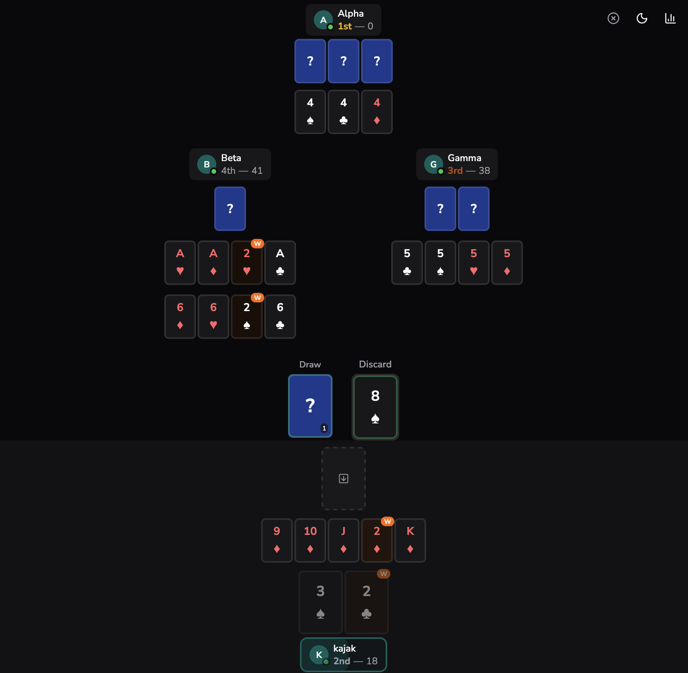

# Gin 13

> [How to Play](https://gin13.kajnekvasil.com/how-to) · [Bot League](https://gin13.kajnekvasil.com/bot-league)

A multi-round card game for 3–4 players, similar to gin/rummy, with a unique wild-card rotation over 13 rounds. Built with Colyseus (WebSocket real-time), React, and PostgreSQL.



## Rules

Over 13 rounds, players draw, meld, and discard to minimise their hand score. Each round has a designated wild rank that ascends sequentially (round 1 = A, round 2 = 2, ..., round 13 = K). The player with the lowest cumulative score after all 13 rounds wins.

See [CONTEXT.md](CONTEXT.md) for the full domain glossary.

## Stack

| Layer | Technology |
|---|---|
| Game server | Colyseus + Express (WebSocket + HTTP API) |
| Client | React + Vite + Tailwind CSS + shadcn/ui |
| Drag & drop | @dnd-kit |
| Animations | Framer Motion |
| Database | PostgreSQL via Prisma |
| Auth | JWT (bcryptjs + jsonwebtoken) |
| Shared | `@gin13/shared` workspace (meld validation) |

## Project structure

```
gin13/
├── server/          Colyseus game server + Express API
│   ├── src/
│   │   ├── rooms/       GameRoom, GameState, game-engine
│   │   ├── routes/      REST API (stats, social, league)
│   │   ├── services/    Stats computation
│   │   └── sim-bots.ts  Bot simulation script
│   └── prisma/          Schema + migrations
├── client/          React + Vite frontend
│   └── src/
│       ├── components/  UI components (cards, melds, staging well)
│       ├── pages/       Route pages (lobby, game, league, etc.)
│       ├── hooks/       useGameRoom — Colyseus state hook
│       ├── stats/       API client + React Query hooks
│       └── auth/        Auth context + Colyseus client
├── shared/          Shared meld validation (`@gin13/shared`)
└── .github/workflows/deploy.yml  CI/CD (build + push to ghcr.io)
```

## Quick start

### Prerequisites

- Node.js 22+
- PostgreSQL running locally

### Setup

```bash
# Install dependencies
npm install

# Set up the database
cd server
cp .env.example .env   # Edit DATABASE_URL
npx prisma migrate deploy
cd ..

# Start dev servers (both server + client)
npm run dev
```

Opens at `http://localhost:5173`. The server runs on `ws://localhost:2567`.

### Available scripts

```bash
npm run dev                # Start both server + client
npm run test -w server     # Run server unit tests
npm run typecheck -w server
npm run sim -w server            # Quick bot match sim (in-memory)
npm run bot-cron -w server       # Bot match with DB persistence
npm run bot-league -w server     # Swiss tournament (creates/advances a season)
```

## Bot League

24 NATO-named bots compete in a daily Swiss tournament. 7 rounds per season, 4-player pods, match-point scoring. Results are persisted to the DB and visible on the Bot League page.

Cron trigger:
```bash
0 6 * * * cd ~/gin13 && npm run bot-league -w server >> /tmp/gin13-league.log 2>&1
```

## Deployment

Docker multi-stage build (node:26-bookworm-slim). The Dockerfile builds the server (tsc) and client (Vite), serving static files from the Express server.

```bash
docker build -t gin13 .
docker run -p 2567:2567 --env-file .env gin13
```

See `docker-compose.yml` for the production configuration (single service + host Postgres).
